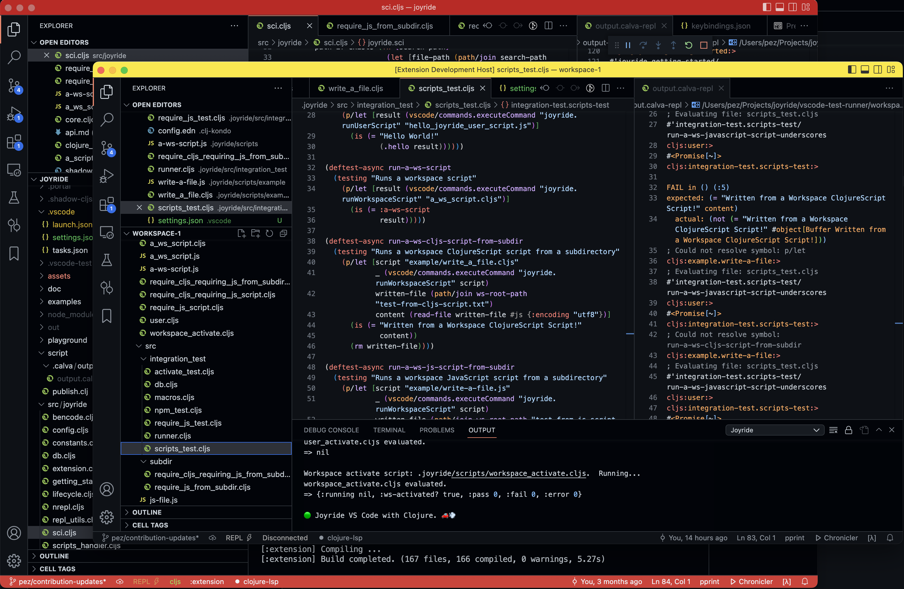

# Contribute

A wonderful way to help the Joyride project is to be part of spreading the word about it. Please consider blogging, tweeting, publishing video content, etcetera, about this way to configure VS Code.

If you want to contribute to the quality and/or feature set of Joyride, helping us identify room for improvement is very welcome! If you want to contribute code, that is also highly appreciated. Please read below how we approach improvements to Joyride.

## Issue

Before writing any code, please create an issue first that describes the problem
you are trying to solve with alternatives that you have considered. A little bit
of prior communication can save a lot of time on coding. Keep the problem as
small as possible. If there are two problems, make two issues. When we
collectively agree on the problem and solution direction, it's time to move on
to a PR.

If the problem statement isn't clear, it's better to start with a
[Discussion](https://github.com/BetterThanTomorrow/joyride/discussions).

## PR

Follow up with a pull request Post a corresponding PR with the smallest change
possible to address the issue. Then we discuss the PR, make changes as needed
and if we reach an agreement, the PR will be merged.

Please do not use `git push --force` on your PR branch for the following reasons:

- It makes it more difficult for others to contribute to your branch if needed.
- It makes it harder to review incremental commits.
- Links (in e.g. e-mails and notifications) go stale and you're confronted with: this code isn't here anymore, when clicking on them.
- Your PR will be squashed anyway.

## Tests

Each bug fix, change or new feature should be tested well to prevent future
regressions.  Tests should be added to
[vscode-test-runner/workspace-1/.joyride/src/integration_test](vscode-test-runner/workspace-1/.joyride/src/integration_test)

We use [@vscode/test-electron](https://code.visualstudio.com/api/working-with-extensions/testing-extension) configured to spawn VS Code Insiders and run the tests in there. The test runner is written using Joyride.

Run the tests from the command line like so:

0. Build the extension (as per the [Development](#development) instructions)
1. `npm run integration-test`

This will download VS Code Insiders, start it, run the tests and then close VS Code Insiders. (If some test results in an error, VS Code Insiders might be left hanging. You then need to force quit it.)

You can also run tests from the [development](#development) extension host. However, the test suite is designed to run with a special environment, to give it control over the user script content. This environment is set as part of the test run when run from the command line. If you run the tests from the REPL, some of them might not work, and _some of them might even mess with your user scripts content_. It's our recommendation to only run specific tests from the REPL and to use the command line for the full suite.

## Development

0. `npm i`
1. In VS Code, **Tasks: Run Build Task**: <kbd>cmd/ctrl+shift+b</kbd>.
   - This starts the nREPL server
   - Wait for shadow-cljs to signal that building is done.
1. Start the extension in debug mode: <kbd>F5</kbd>
1. Back in the Joyride project window: Connect the REPL to the nREPL server and the shadow-cljs build `:extension`

By default, the debug extension host session opens up [the integration testing project](vscode-test-runner/workspace-1/), which is part of this repository/project. (See [Tests](#tests) for more on the tests.) This makes it easy to test Joyride with relevant sample content, manually, or via integration test code. It also means that content you create or change there can be committed back to the repository. Please note that we want any Joyride content in this integration test project's `script` and `src` directories to be consumed by integration tests, so if you think some content should be added, please also add integration tests for it.

When the Joyride project directory is open in VS Code, you will recognize this window by it's title bar, and the default extension host window is also recognizable this way.

In this screenshot the Joyride project window, with a Joyride-red title bar, is behind the extension host window, with a Joyride-yellow title bar. (The status bar of the Joyride window is also red, because VS Code highlights it for being the window where the debug session is spawned and controlled from. It might be some other color on your machine, depending on what theme you use.)

## Feedback welcome

Please let us know how the development process works for you.

A great place to discuss Joyride development things is in the [#joyride](https://clojurians.slack.com/archives/C03DPCLCV9N) channel at [the Clojurians Slack](http://clojurians.net/).

Happy contributing! ❤️🙏