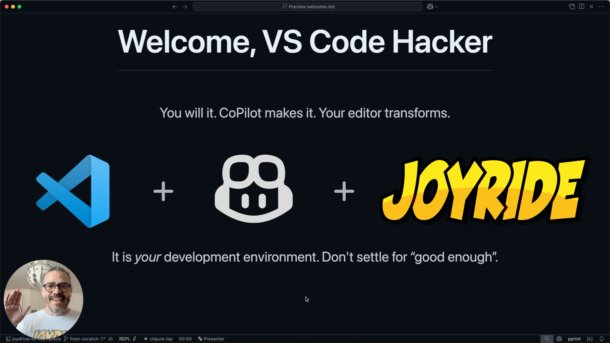

# Extend VS Code without extensions

Modify your VS Code while it is running. The Visual Studio Code API, as well as the APIs of its extensions, are at your command! Joyride makes VS Code scriptable in a very similar way to how how Emacs users can hack their editor.

[](https://www.youtube.com/watch?v=-yYJV7WEFjI)

[YouTube: Copilot hacked my editor](https://www.youtube.com/watch?v=-yYJV7WEFjI)

Try this yourself with the project used for the demo video: https://github.com/PEZ/joydrive-lm-tool-prezo

See [doc/api.md](https://github.com/BetterThanTomorrow/joyride/blob/master/doc/api.md) for documentation about the Joyride API.

Your feedback is highly welcome!

## Copilot integration

Joyride includes a Language Model Tool that gives Copilot access to the scripting environment so that it can hack your editor while your are working with it.

> [!NOTE]
> Joyride gives you and CoPilot full access to the VS Code API and execution environment. **You are responsible for the code that is executed in Joyride**.
>
> If you don't want Copilot to have any access to the Joyride REPL tool, then disable it in settings: `joyride.lm.enableReplTool`.

## Examples

See the [examples](./examples) for examples including:

* Workspace activation script
* [Add a fuzzy git commit search and lookup menu](examples/.joyride/src/git_fuzzy.cljs)
* Creating an interactive Webview
* Using `npm` dependencies (The wonderful [posthtml-parser](https://github.com/posthtml/posthtml-parser) in this case)
* [Contribute a File Explorer tree view and commands (and anything)](examples/.joyride/scripts/sidecar/README.md) by creating a Joyride Sidecar extension on the fly.
* Terminal creation and control
* Calva Structural Editing enhancements
* Opening and showing project files
* Fontsize manipulation
* The Joyride Extension API
* The `joyride.core` namespace
* Using [clojure.zip](https://clojuredocs.org/clojure.zip)
* Using [Hickory](https://github.com/clj-commons/hickory) (well, `hickory.select`, at least)

## User and Workspace scripts

Joyride supports User and Workspace scripts:

* _User_ scripts: `<user home>/.config/joyride/scripts`
* _Workspace_ scripts: `<workspace root>/.joyride/scripts`

You can run or open the scripts using commands provided (search the command palette for **Joyride**):

* **Joyride Run User Script...**, default keybinding `ctrl+alt+j u`
* **Joyride Open User Script...**
* **Joyride Run Workspace Script...**, default keybinding `ctrl+alt+j w`
* **Joyride Open Workspace Script...**

**Note, about Clojure namespaces**: Used with ClojureScript, Joyride effectively has a classpath that is `user/scripts:user/src:workspace/scripts:workspace/src`. A file `<User scripts dir>/foo_bar.cljs`, will establish/use a namespace `foo-bar`. As will a file `<Workspace scripts dir>/foo_bar.cljs`. Any symbols in these files will be shared/overwritten, as the files are loaded and reloaded. There are probably ways to use this as a power. Please treat it as a super power, because you might also hurt yourself with it.

## Quickest Start - Start Here - Install Joyride

Installing Joyride will also install, and run, a sample `user_activate.cljs` User script. You can use this script as a base for init/activation stuff of your VS Code environment.

Joyride installs two "regular” User scripts:

* `<user-home>/.config/joyride/scripts/hello_joyride_user_script.cljs`
* `<user-home>/.config/joyride/scripts/hello_joyride_user_script.js`

You can run these scripts with the commands mentioned above.

Also: In the **Joyride: Run Workspace Script** menu, there is a command for downloading and installing some default/example workspace scripts.

## Quick Start - Ask Copilot to do some Joyride hacking

You can also ask Copilot to create Joyride scripts for you.

We're still discovering how to best instruct the AI for helping with Joyride scripting. You can use [these custom instructions](prompts/general/copilot-instructions.md) as a start. And please share your experiences with custom instructsions with us. 🙏

## Quick Start - Start your Scripts Library

Joyride lets you bind keyboard shortcuts to its User and Workspace scripts.

* User Scripts: `<user home>/.config/joyride/scripts`
* Workspace scripts: `<workspace root>/.joyride/scripts`

Let's go with a Workspace script: Create a folder and open it in VS Code.

Both the scripts here do almost the same thing: They show an information message and writes to a file in
the root of the workspace. Create both, why don't ya?

### Using ClojureScript

Create the file `.joyride/scripts/example/write_a_file.cljs`:

``` clojure
(ns example.write-a-file
  (:require ["fs" :as fs]
            ["path" :as path]
            ["vscode" :as vscode]
            [clojure.string :as str]))

(defn info [& xs]
  (vscode/window.showInformationMessage (str/join " " xs)))

(def root-path (-> (first vscode/workspace.workspaceFolders) .-uri .-fsPath))
(info "The root path of this workspace:" root-path)
(fs/writeFileSync (path/resolve root-path "test-from-cljs-script.txt")
                  "Written from a Workspace ClojureScript Script!")
```

### Using JavaScript

You can use both JavaScript and ClojureScript with Joyride. However, Also the JavaScript support in Joyride is experimental and not at par with the ClojureScript support. Plus... you will only get to enjoy Interactive Programming using ClojureScript.

Still want to use JavaScript? Create the file `.joyride/scripts/example/write-a-file.js`:

```javascript
const fs = require("fs");
const path = require("path");
const vscode = require("vscode");

function info(...xs) {
  vscode.window.showInformationMessage(xs.join(" "));
}

const rootPath = vscode.workspace.workspaceFolders[0].uri.fsPath;
info("The root path of this workspace:", rootPath);
fs.writeFileSync(
  path.resolve(rootPath, "test-from-js-script.txt"),
  "Written from a Workspace JavaScript Script!"
);
```

### Bind the scripts to a keyboard shortcut.

You can run the scripts from the **Joyride: Run Workspace Script..** menu. But for the exercise we'll create keyboard shortcuts too:

In your keyboard shortcuts JSON file, add:

``` json
 {
        "key": "shift+ctrl+alt+j 1",
        "command": "joyride.runWorkspaceScript",
        "args": "example/write-a-file.js"
 }
 {
        "key": "shift+ctrl+alt+j 2",
        "command": "joyride.runWorkspaceScript",
        "args": "example/write_a_file.cljs"
 }
```

Now you can run the scripts from the keyboard shortcuts!

Note: Because of how VS Code renders the command palette it is good to add the default `joyride.runWorkspaceScript` keybinding as the last bindings in the JSON file:

```json
    {
        "command": "joyride.runWorkspaceScript",
        "key": "ctrl+alt+j w",
    }
```

See [doc/configuration.md](https://github.com/BetterThanTomorrow/joyride/blob/master/doc/configuration.md) for full configuration options.

## Quickest Start - Run some Code

This currently only works with ClojureScript code:

1. Bring up the VS Code Command Palette (`cmd/ctrl+shift+p`)
2. Execute **Joyride: Run Clojure Code...**
3. Type in some code into the prompt, e.g.
    ```clojure
    (require '["vscode" :as vscode]) (vscode/window.showInformationMessage "Hello World!")
    ```
4. Submit

## Quickest Start - Evaluate the selection

Only works with ClojureScript code:

1. Select some code (e.g. the code some lines above in this markdown file, even if in Preview.)
2. Execute **Joyride: Evaluate Selection**, (<kbd>ctrl</kbd>+<kbd>alt</kbd>+<kbd>j</kbd>, <kbd>enter</kbd>)

## Quick Start - Start the REPL

While developing Joyride scripts you should of course do it leveraging Interactive Programming (see [this video](https://www.youtube.com/watch?v=d0K1oaFGvuQ) demonstrating it).

### nREPL Server

Joyride has an [nREPL](https://nrepl.org) server and commands for starting and stopping it. By default, the server will be bound to `127.0.0.1` on an available port. The host address can be configured via the setting `joyride.nreplHostAddress`. Then connect your nREPl client (Calva, Clojure CLI, or whatever.)

Speaking of Calva. It has a command for starting the Joyride nREPL server and connect to it in one go. This video demonstrates starting from scratch, including installing Joyride.

https://user-images.githubusercontent.com/30010/167246562-24638f12-120b-48e9-893a-7408d5beeb77.mp4

The demo ”project” used here is only a directory with this file `hello_joyride.cljs`. Here's the code, if you want to try it out yourself:

```clojure
(ns hello-joyride
  (:require ["vscode" :as vscode]
            [promesa.core :as p]))

(comment
  (+ 1 2 3 4 5 6 7 8 6)
  (-> (vscode/window.showInformationMessage
       "Come on, Join the Joyride!"
       "Be a Joyrider")
      (p/then
       (fn [choice]
         (println "You choose to:" choice)))))

"Hello World"
```

## How does this work?

* Joyride is Powered by [SCI](https://github.com/babashka/sci) (Small Clojure Interpreter).
* Joyride makes its extension host access, available to your scripts.

## Support and feedback

You'll find us in the `#joyride` channel on the [Clojurians Slack](http://clojurians.net)

## News

* Show HN: https://news.ycombinator.com/item?id=31203024#31206003

### Twitter

Follow the [#vsjoyride](https://twitter.com/search?q=%23vsjoyride&src=typed_query&f=live) hashtag on Twitter!
