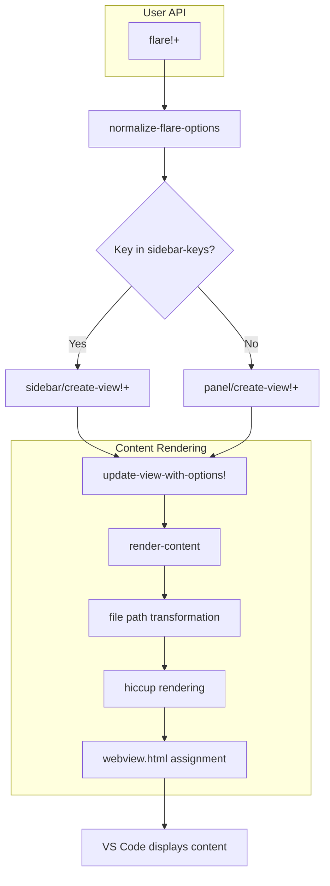
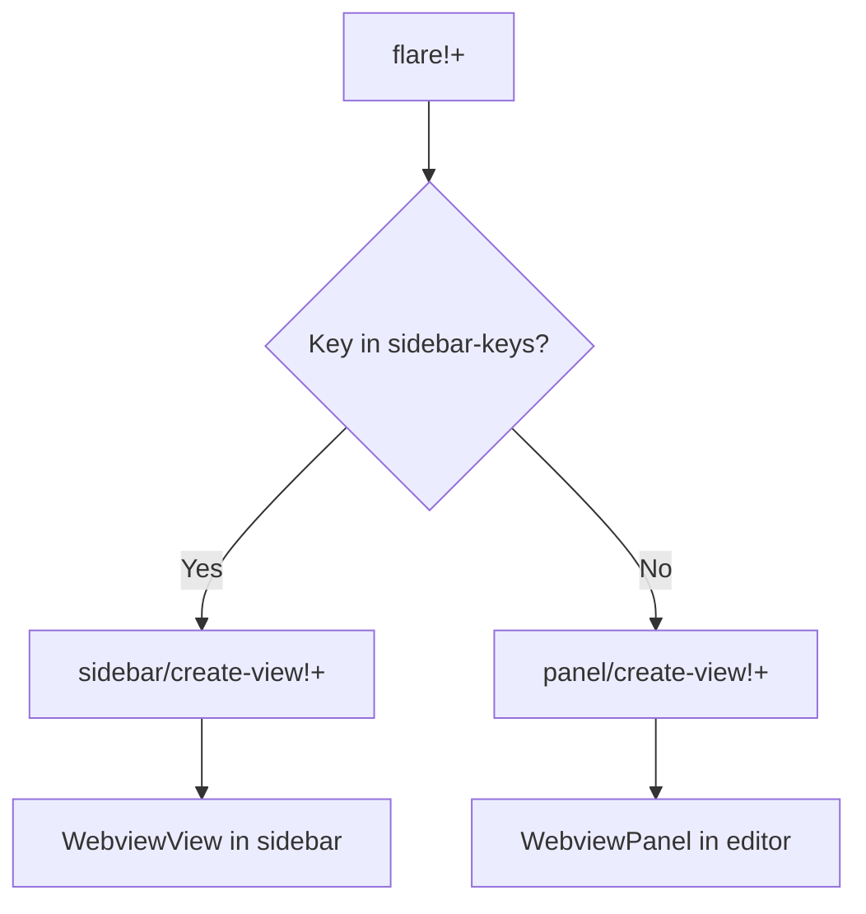
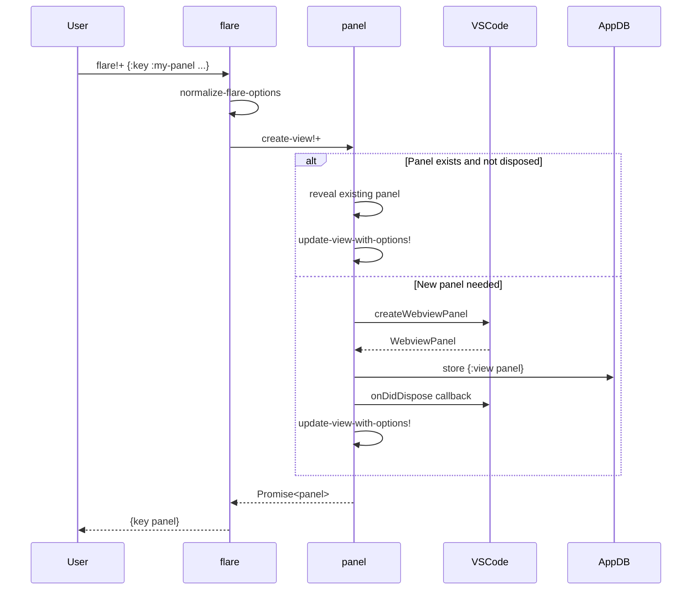
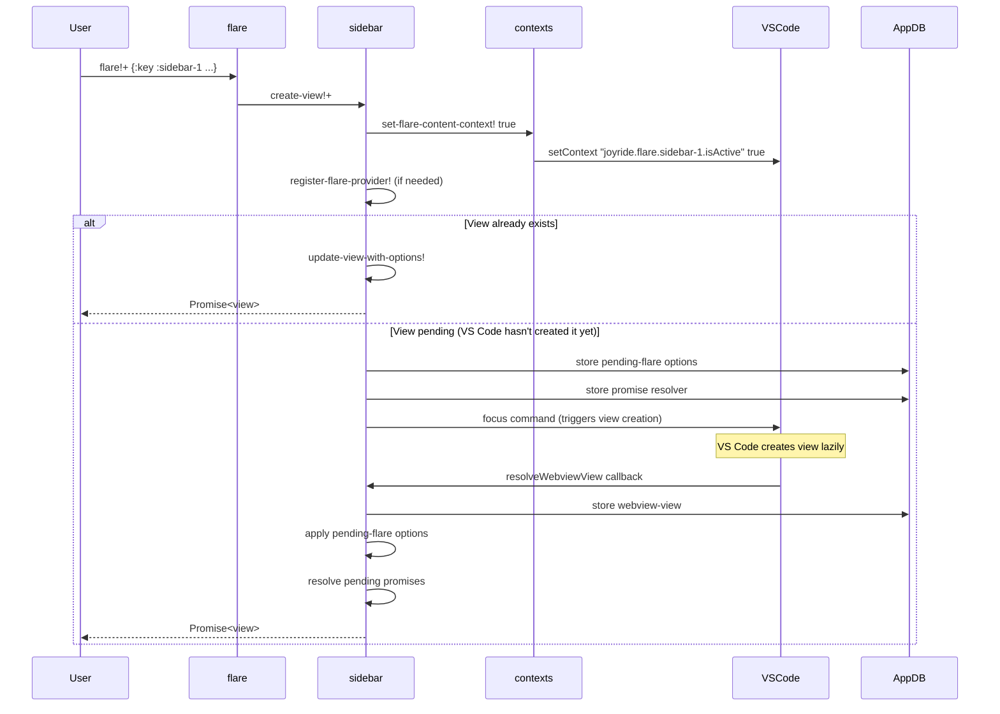
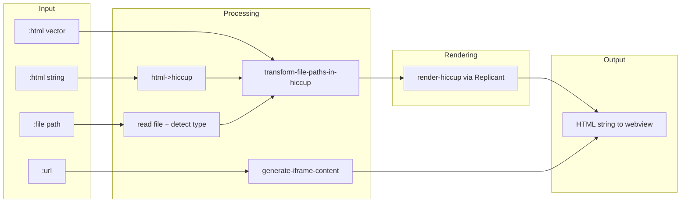
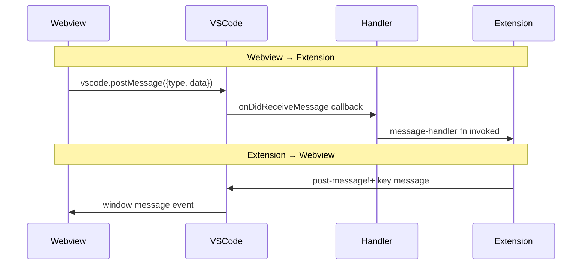

# Joyride Flares Architecture

> **Prerequisites**: Before reading this document, you must be familiar with:
> - [User documentation for Flares](../../doc/flares.md) — Complete API reference and usage patterns
> - [Flares examples](../../examples/.joyride/src/flares_examples.cljs) — Practical usage examples demonstrating all features

This document describes the internal architecture of the Flares feature for developers and maintainers.

## Value Proposition Summary

Flares provide a WebView-based UI system enabling Joyride scripts to create rich, interactive panels and sidebar views. Key capabilities:

- **Unified API**: Single `flare!+` function handles both panels and sidebars
- **Multiple content sources**: Hiccup, HTML strings, files, URLs
- **Bidirectional messaging**: Extension ↔ WebView communication
- **View reuse**: Key-based identification for updating existing views
- **File path resolution**: Automatic conversion of local paths to webview-safe URIs

## Data Flow Overview



## Module Structure

```
src/joyride/
├── flare.cljs           # Public API and orchestration
├── flare/
│   ├── panel.cljs       # Panel creation, content rendering, Hiccup processing
│   └── sidebar.cljs     # Sidebar view management, provider registration
├── html/
│   ├── file_paths.cljs  # File path detection and transformation
│   └── to_hiccup.cljs   # HTML-to-Hiccup conversion
└── when_contexts.cljs   # VS Code when-context management
```

### Responsibility Boundaries

| Module | Responsibility |
|--------|---------------|
| `flare` | Public API, option normalization, routing to panel/sidebar |
| `flare.panel` | WebviewPanel creation, Hiccup→HTML rendering, icon resolution |
| `flare.sidebar` | WebviewViewProvider registration, deferred view creation |
| `html.file_paths` | Path detection in Hiccup attributes, transformation |
| `html.to_hiccup` | HTML string parsing to Hiccup (for `:html` strings) |
| `when_contexts` | VS Code `setContext` commands for conditional UI |

## State Architecture

All flare state lives in the centralized `db/!app-db` atom:

```clojure
{:flares {<key> {:view <WebviewPanel|WebviewView>
                 :message-handler <Disposable|nil>}}

 :flare-sidebar-views {<slot> {:provider-registered? <boolean>
                               :provider-disposable <Disposable>
                               :webview-view <WebviewView|nil>
                               :dispose-listener <Disposable>
                               :pending-flare {:key <key> :options <map>}
                               :promise-resolvers [{:key <key> :resolve-fn <fn>}]}}}
```

### State Keys Explained

- `:flares` — Active flares indexed by user-provided key, stores the view object and message handler disposable
- `:flare-sidebar-views` — Per-slot metadata for sidebar infrastructure (slots 1-5)
- `:pending-flare` — Queued flare options awaiting VS Code's lazy view creation
- `:promise-resolvers` — Functions to call when VS Code creates the view

## View Types and Routing



The `sidebar-keys` set (`#{:sidebar-1 :sidebar-2 :sidebar-3 :sidebar-4 :sidebar-5}`) determines routing. Any other key creates a panel.

## Panel Lifecycle



### Key Implementation Details

1. **Panel reuse**: Existing panels are found by key in `:flares`, revealed, and updated
2. **Disposal cleanup**: `onDidDispose` removes the flare from state and disposes message handlers
3. **Icon resolution**: Supports `:flare/icon-default`, string paths, URLs, and `{:light :dark}` maps

## Sidebar Lifecycle

Sidebars have a more complex lifecycle due to VS Code's lazy view creation.



### Why the Deferred Promise Pattern?

VS Code creates sidebar WebviewViews **lazily** — only when the view becomes visible. This creates a timing challenge:

1. User calls `flare!+` with `:sidebar-2`
2. We set the `when` context to make the view visible in VS Code's UI
3. VS Code **may not** immediately create the view
4. We need to return a promise that resolves to the actual view

**Solution**: Store `pending-flare` options and `promise-resolvers`. When VS Code eventually calls `resolveWebviewView`, we apply the stored options and resolve all pending promises.

### Why When Contexts?

The sidebar views are declared in `package.json` with `when` conditions:

```json
{
  "type": "webview",
  "id": "joyride.flare.sidebar-2",
  "when": "joyride.flare.sidebar-2.isActive"
}
```

Setting the context to `true` makes VS Code show the view in the sidebar. Setting it to `false` hides it. This enables dynamic visibility without VS Code restart.

**Important**: The context must be set **before** attempting to create the view, otherwise VS Code won't create it (the view's `when` condition would be false).

## Content Processing Pipeline



### File Path Transformation

Paths in Hiccup/HTML are transformed to webview-safe URIs via `->webview-uri-str`:

1. **Template expansion**: `{joyride/user-dir}` → actual path
2. **Workspace resolution**: Relative paths resolved against workspace root
3. **Uri conversion**: `vscode/Uri.file` → `webview.asWebviewUri`

Attributes processed: `:src`, `:href`, `:action`, `:background`, `:data`, `:formaction`, `:poster`, `:xlink:href`, `:srcset`, and `url()` in `:style`.

### Hiccup Rendering

Uses [Replicant](https://github.com/cjohansen/replicant) for Hiccup→HTML conversion with special handling:

- `:script` and `:style` tags use `:innerHTML` to prevent content escaping
- Standard Hiccup syntax with Reagent-style `:style` maps supported

## Message Handling



### Handler Lifecycle

- Handlers are registered via `webview.onDidReceiveMessage`, returning a `Disposable`
- The disposable is stored in `:flares` state under `:message-handler`
- When updating a flare, the old handler is disposed before registering a new one
- On flare disposal, the handler is cleaned up automatically

## Extension Initialization

During activation (`extension.cljs`):

```clojure
(when-contexts/initialize-flare-contexts!)  ; Sets sidebar-1 true, others false
(flare-sidebar/register-flare-provider! 1)  ; Pre-registers slot 1 provider
```

This ensures:
1. Sidebar slot 1 is visible by default (for discoverability)
2. The provider for slot 1 is ready immediately
3. Other slots remain hidden until explicitly used

## Known Behaviors and Gotchas

### Sidebar Slot 1 Special Treatment

Slot 1 receives default "no content" placeholder HTML when the view is created without a pending flare. This provides user discoverability — users see the Joyride sidebar container exists and can be populated.

Other slots (2-5) remain completely hidden until explicitly used.

### View Disposal and Recreation

When a sidebar view is disposed (user closes it), the state is cleaned up:
- `:webview-view` removed from slot data
- `:pending-flare` cleared
- `when` context set to false

A subsequent `flare!+` call will go through the full creation flow again, including re-enabling the `when` context.

### Provider Registration is Idempotent

`register-flare-provider!` checks `:provider-registered?` before registering. Multiple calls for the same slot are safe and return the existing disposable.

### Panel vs Sidebar Icon Handling

- **Panels**: Support custom icons via `:icon` option
- **Sidebars**: Icons are defined in `package.json` and cannot be changed at runtime

## Testing Considerations

### Unit Testable Code

The following can be unit tested without VS Code:
- `html.file_paths` — Pure path transformation functions
- `html.to_hiccup` — HTML parsing (uses posthtml-parser)
- `panel/render-hiccup` — Hiccup rendering logic

### Integration/E2E Testing

View creation, message handling, and VS Code interactions require the extension development host or integration test framework.

### REPL Exploration

```clojure
;; Check current flare state
(select-keys @db/!app-db [:flares :flare-sidebar-views])

;; Check when contexts
(:contexts @wc/!db)

;; Test flare creation
(require '[joyride.flare :as flare])
(flare/flare!+ {:key :test :html [:h1 "Test"]})
(flare/ls)
(flare/close! :test)
```
