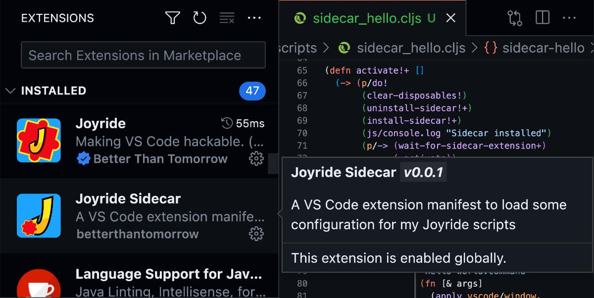

# Giving your script a custom Extension Manifest

Your Joyride scripts run in the context of the Joyride extension, where the extension manifest is fixed, and, unfortunately, of quite limited use for many scripts. Don't fret! To declare custom extension points you can use custom extension manifest and install it as an extension. Then your scripts can use those contributions from your scripts! Introducing **Joyride Sidecar**:

Since the boilerplate for this is a bit involved we have created a starting point. The extension manifest in this folder, and a script: [../scripts/sidecar_hello.cljs](../scripts/sidecar_hello.cljs).

The scripts takes care of packaging the sidecar extension, installing it, and also uninstalling it. Further, it provides the life cycle management for doing this dynamically when when you have updated the manifest, including disposing of resources and re-registering new ones.

Copy the script and this folder to your Joyride User Scripts folder and you will be on your way to extend VS Code in all the ways it allows for with its extension API. Test it out with the command **Joyride: Run User Script...** and select the `sidecar_hello.cljs` script. You should see that the extension gets installed and that you get a custom view in the Explorer pane.

For a more elaborate introduction to how this all works, see the article [Extend VS Code in user space, without invented restrictions](https://blog.agical.se/en/posts/extend-vs-code-in-user-space--without-invented-restrictions/).

NB: When you use this for your own scripts you probably will want to make it a general **Load Joyride Sidecar** script, and keep the registering of disposable and such together with your scripts that use them. This way you can also use the same sidecar for your workspace scripts.

If a workspace script need a custom sidecar, at a minimum you'll need to change the extension id in the new manifest.