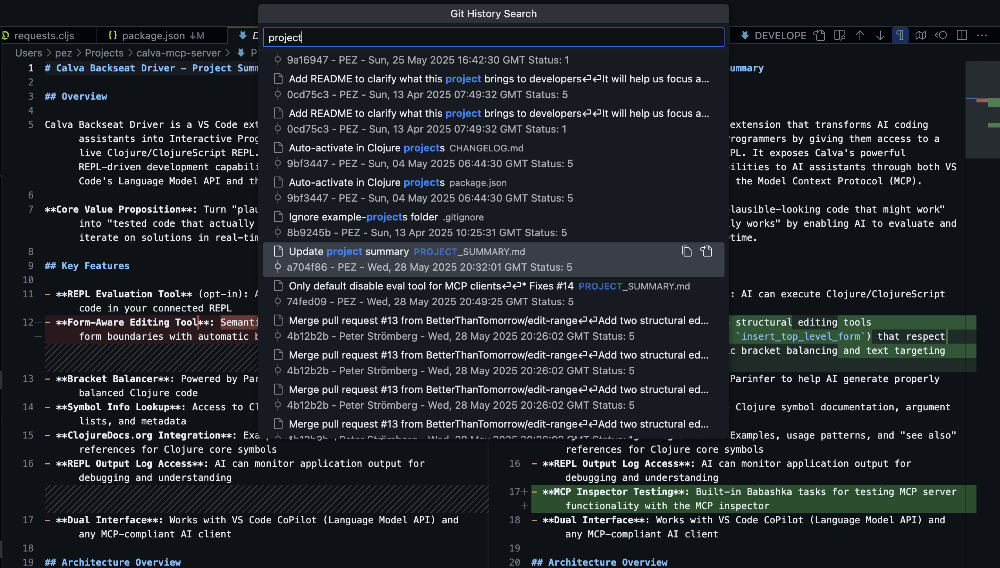
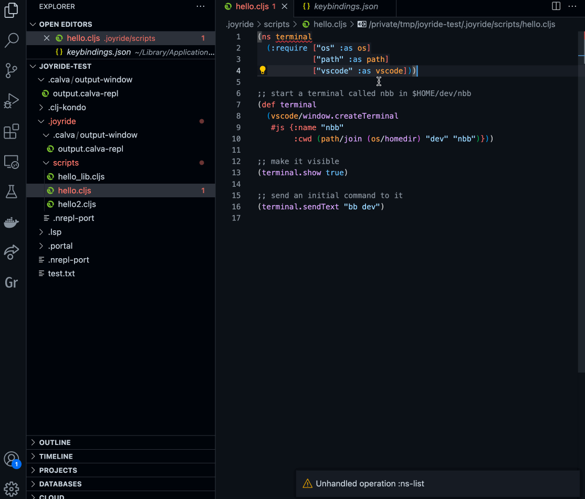
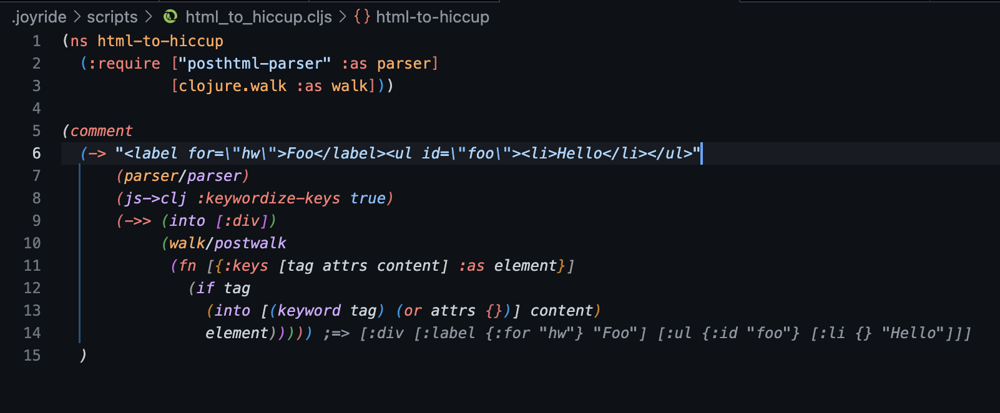
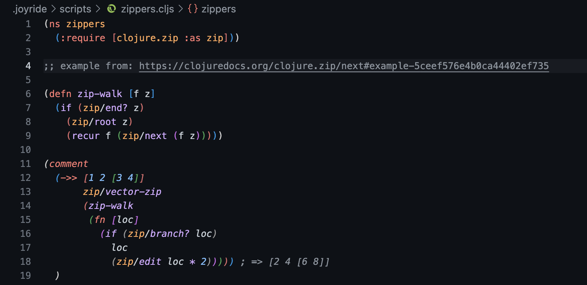
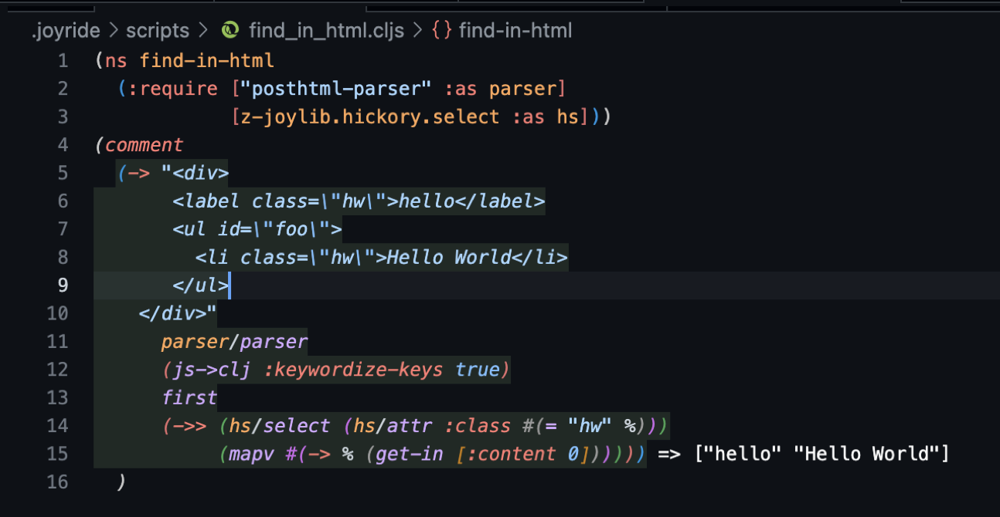

# Joyride Examples

Demonstrating some ways to [Joyride VS Code](https://marketplace.visualstudio.com/items?itemName=betterthantomorrow.joyride). You'll find the examples in the [examples/.joyride](./.joyride) folder of this repository.

See also: [Joyride @ London Clojurians, Nov 29 2022](https://github.com/PEZ/london-clojurians-joyride)

[](https://www.youtube.com/watch?v=ObjIR08t3lg)

* The [meetup](https://www.meetup.com/london-clojurians/events/286030325/) was about how to hack [Visual Studio Code](https://code.visualstudio.com/) like it was [Emacs](https://www.gnu.org/software/emacs/), using the VS Code Extension [Joyride](https://marketplace.visualstudio.com/items?itemName=betterthantomorrow.joyride).
* Recording: https://www.youtube.com/watch?v=ObjIR08t3lg

## Activation scripts

One for the Workspace and one on he User level:

### `user_activate.cljs`

A User [user_activate.cljs](../assets/getting-started-content/user/scripts/user_activate.cljs) script that shows:

* How to write to, _and show_, the Joyride output channel.
* A re-runnable recipe for registering VS Code disposables as with the Workspace `activate.cljs` example.
* A way to safely require VS Code extensions from `activate.cljs` scripts, where the extensions might yet not be activated.

**NB**: This script will be automatically insstalled for you if you do not have a User `activate.cljs` script already.

### `workspace_activate.cljs`

A Workspace [activate.cljs](../assets/getting-started-content/workspace/scripts/workspace_activate.cljs) script that registers a `vscode/workspace.onDidOpenTextDocument` event handler. Demonstrates:

* Using the `joyride.core/extension-context` to push disposables on its `subscriptions` array. Making VS Code dispose of them when Joyride is deactivated.
* A re-runnable recipe to avoid re-registering the event handler. (By disposing it and then re-register.)

## Fuzzy git history search menu

A quick-pick menu for fuzzy searching your git history
* Instant preview of diffs
* Button for copying the commit id
* Button for opening the file



Source: [examples/.joyride/src/git_fuzzy.cljs](.joyride/src/git_fuzzy.cljs)

## Give yourself a JavaScript REPL

Evaluate code in JavaScript files, similar to how it's done with Clojure and ClojureScript.

https://github.com/BetterThanTomorrow/joyride/assets/30010/d5becc9d-d079-4371-9789-7c739ed0439f

Source, including some usage info: [examples/.joyride/scripts/js_repl.cljs](.joyride/scripts/js_repl.cljs)

## Create a Hover Provider

In [examples/.joyride/src/problem_hover.cljs](.joyride/src/problem_hover.cljs) there's a Hover Provider which can be activated from the template [user_activate.cljs](#user_activatecljs). It creates an extra Diagnostics item in the hover. It is registered after a significant delay (5 seconds) to make sure this hover item goes at the very top of the hover. Looks like so:


It's a workaround for this issue on Calva: https://github.com/BetterThanTomorrow/calva/issues/2001

## Create a Webview

`webview/example.cljs`

Create a Webview. Uses [scittle](https://babashka.org/scittle/) + [reagent](https://github.com/reagent-project/reagent) for the contents of the webview.

Live demo here: https://twitter.com/borkdude/status/1519607386218053632

## Quick and Simple Webviews with Flares

Createing Webviews is such a common thing, that Joyride has a way to quickly create simple webviews. They can also be created in as a sidebar panel view. And they support using [Replicant Hiccup](https://replicant.fun/hiccup/).

```clojure
(require '[joyride.flare :as flare])

;; Display HTML in a Webview
(flare/flare! {:html [:h1 "Hello, Joyride Flares!"]
               :title "Greeting"
               :key "example"})

;; Close the flare
(flare/close! "example")

;; SVG visualization
(flare/flare! {:html [:svg {:height 100 :width 100}
                      [:circle {:r 40 :cx 50 :cy 50 :fill "blue"}]]
               :title "Blue Circle"})

;; Custom tab icon
(flare/flare! {:html [:img {:src "https://raw.githubusercontent.com/sindresorhus/awesome/refs/heads/main/media/logo.png"}]
               :title "Awesome"
               :icon "https://raw.githubusercontent.com/sindresorhus/awesome/refs/heads/main/media/logo.png"})

;; Display in sidebar instead of panel
(flare/flare! {:html [:div
                      [:h2 "Sidebar View"]
                      [:p "This appears in the Joyride sidebar"]]
               :title "Side Panel"
               :sidebar-panel? true})
```

The `:key` parameter allows reusing the same panel for updates.

## Terminal

`.joyride/scripts/terminal.cljs`

Create a Terminal, send text to it and show it.



## Fontsize

[.joyride/scripts/fontsize.cljs](.joyride/scripts/fontsize.cljs)

Manipulates the editor font size. **NB: This changes the *global/User* font size, and if you have configured `editor.fontSize` in the *Workspace*, nothing will appear to happen, you might be in for a surprise when opening other workspaces.**

Live demo: https://twitter.com/borkdude/status/1519709769157775360

## Structural Editing

`.joyride/scripts/ignore_form.cljs`

Adds a command for (un)ignoring (Clojure-wise) the current enclosing form.
Depends on that the [Calva](https://calva.io) extension is installed, because it is what
helps us find out of the current list in order to insert, or remove, the ignore
tag (`#_`).

If you want to use this script, you can setup a VSCode key binding for it by
editing VSCode's keybindings JSON and adding the following. Note that this
overrides the default comment-keyboard-shortcut on macOS. The result is that
pressing CMD-/ in a Clojure file will use the (un)ignore script when there is no
selection, and keep using the default comment action (prepend the line with `;;`
when there is a selection). For Windows you probably want to change the key to
the default Windows comment keyboard shortcut.

```json
{
  "key": "cmd+/",
  "command": "joyride.runWorkspaceScript",
  "args": "ignore_form.cljs",
  "when": "!editorHasSelection && editorTextFocus && !editorReadOnly && editorLangId =~ /clojure|scheme|lisp/"
}
```

* Video here: https://www.youtube.com/watch?v=V1oTf-1EchU
* Tweet to like/comment/retweet: https://twitter.com/pappapez/status/1519825664177807363

## Structural Editing via rewrite-clj

[.joyride/scripts/port_arrow_form.cljs](.joyride/scripts/port_arrow_form.cljs)

Converts a midje arrow clause into a `clojure.test/is` form, when selected. Shows how to use `rewrite-clj`
to for parsing, getting S-Expressions, as well as how to use syntax-quote for easy form building.

```clojure
(+ 2 2) => 4
;; is changed to
(is (= 4 (+ 2 2)))
```

```json
{
  "key": "f3",
  "command": "joyride.runWorkspaceScript",
  "args": "port_arrow_form.cljs",
  "when": "editorHasSelection && editorTextFocus && !editorReadOnly && editorLangId == 'clojure'"
}
```

## Toggle between interface and implementation when using [Polylith](https://polylith.gitbook.io/polylith)

[.joyride/scripts/toggle_between_interface_and_impl.cljs](.joyride/scripts/toggle_between_interface_and_impl.cljs)

When using Polylith, you have interface files and implementation files in your
components. This script helps you navigate between them: when you're in the
interface, it will switch to the implementation and vice versa. Note: not all
possible cases are implemented in this example, specifically when you're in
`interface.clj`, this script does not know how to handle that. See also the
documentation in the script file.

## Joyride API

Joyride comes with the `joyride.core` namespace, giving you access to things as the extension context, the Joyride output channel, and some info about the evaluation environment.

And, you can also script Joyride with Joyride using its Extension API.

Example script: [`.joyride/scripts/joyride_api.cljs`](.joyride/scripts/joyride_api.cljs)

See also: the [Joyride API docs](../doc/api.md)

## Opening a file

The [open_document.cljs](.joyride/scripts/open_document.cljs) script asks if you want to open one of the examples and then opens a random `.cljs` file from the `scripts` folder.

Joyride API used:

* [`promesa.core`](https://funcool.github.io/promesa/latest/user-guide.html)

[VS Code APIs](https://code.visualstudio.com/api/references/vscode-api) used:

* `vscode/window.showInformationMessage`
* `vscode/workspace.findFiles`
* `vscode/workspace.openTextDocument`
* `vscode/window.showTextDocument`

## Build your own Joyride library

Adding commands to your workflow can be implemented in several ways, including:

1. Define a `joyride.runCode` keyboard shortcut with some code.
2. Make a Joyride script, optionally binding a keyboard shortcut to it
3. Define a function in a namespace that you know is required and call the function from a `joyride.runCode` keyboard shortcut.

You will probably be using all three ways. And even combos of them. Here we'll explore the third option a bit.

Start with creating a User script `my_lib.cljs` with this content:

```clojure
(ns my-lib
  (:require ["vscode" :as vscode]
            [promesa.core :as p]))
```

Make sure it is required from User `activate.cljs`:

```clojure
(ns activate
  (:require ...
            [my-lib]
            ...))
```

Here are some `my-lib` examples. NB: _These examples are included as **Getting started** User scripts content. See your user scripts, or `assets/getting-started-content/user/my_lib.cljs` in this repository._

### Lookup current symbol in Clojuredocs

See [.joyride/scripts/clojuredocs.cljs](.joyride/src/clojuredocs.cljs) for @seancorfield's script for looking up the current symbol on [clojuredocs.org](https://clojuredocs.org).

If you require that script in your [User activation.cljs](#user_activatecljs), you can then define a keyboard shortcut like so for easy lookup:

``` json
    {
        "command": "joyride.runCode",
        "args": "(clojuredocs/lookup-current-form-or-selection)",
        "key": "ctrl+alt+c d",
    }
```

Note that Calva has several facilities for looking up things in Clojuredocs, but if you like to have it in an inline browser view, you can have it with this script.

### Find-in-file with regexp toggled on

VS Code does not provide a way to reliably start a find-in-file with regular expressions toggled on. You can add a function to your `my-lib` namespace that does it. Like this one:

```clojure
(defn find-with-regex-on []
  (let [selection vscode/window.activeTextEditor.selection
        selectedText (vscode/window.activeTextEditor.document.getText selection)
        regexp-chars (js/RegExp. #"[.?+*^$\\|(){}[\]]" "g")
        newline-chars (js/RegExp. #"\n" "g")
        escapedText (-> selectedText
                        (.replace regexp-chars "\\$&")
                        (.replace newline-chars "\\n?$&"))]
    (vscode/commands.executeCommand "editor.actions.findWithArgs" #js {:isRegex true
                                                                       :searchString escapedText})))
```

This function takes care of escaping regular expression characters in the selected text as well as prepending newline characters with `\n?` which mysteriously makes VS Code enable multiline regexp search.

Example shortcut definition:

```json
    {
        "key": "cmd+ctrl+alt+f",
        "command": "joyride.runCode",
        "args": "(my-lib/find-with-regex-on)",
    },
```

(Or use the default find-in-file shortcut if you fancy.)

https://user-images.githubusercontent.com/30010/172149989-69e87313-afeb-44fc-a71d-417a439dac32.mp4

#### Customize findInFiles (searching the whole workspace in the sidebar)

A similar approach works to customize the workspace finder in the sidebar.  The following code will open up the sidebar with some values preset.  A complete list of available parameters is [here.](https://github.com/microsoft/vscode/blob/a73b3fac964271be1a54eb15889b0d534a5309ea/src/vs/workbench/contrib/search/browser/searchActionsFind.ts#L39)

```clojure
(ns find-in-files
  (:require ["vscode" :as vscode]
            [joyride.core :as joyride]))

(defn find-regexp-in-src []
  (vscode/commands.executeCommand "workbench.action.findInFiles"
                                  #js {:isRegex true
                                       :filesToInclude "src/**/*.clj"}))
```
This function can be mapped to a keybinding as above.

### Workspace file system

The [.joyride/scripts/ws.cljs](.joyride/scripts/ws.cljs) script shows two things:

1. How to find the current workspace root (or the first workspace folder, really)
2. How to read the contents of a file in the workspace

Both examples use a utility script: [.joyride/src/util/workspace.cljs](.joyride/src/util/workspace.cljs)

### requiring JavaScript files

You can use code written in JavaScript (or compiled to JavaScript) with Joyride by using absolute or relative paths to these scripts in your requires.

[.joyride/scripts/require_js_file.cljs](.joyride/scripts/require_js_file.cljs) does this, using an ns-form require that looks like so:

```clojure
(ns require-js-file
  (:require ["../src/hello-world.js" :as hello-world] :reload))
```

It can then use the exports from [.joyride/src/hello-world.js](.joyride/src/hello-world.js).

This means you can write your scripts using JavaScript if you like, using only a small glue script written in Clojure, that require the JS code.

By adding the `:reload` option to the require, the JavaScript code is reloaded when you run/evaluate the Clojure glue code, so you can enjoy some interactive programming this way. For when you have JavasScript code that will stay stable, skip the `:reload` option.

### npm packages

You can use packages from `npm` in your Joyride scripts. There's an example of this, using [posthtml-parser](https://github.com/posthtml/posthtml-parser) in
[html_to_hiccup.cljs](.joyride/scripts/html_to_hiccup.cljs)



To use a package from npm, Joyride needs to find it somewhere in the path from the using script and up to the system root. Some directories to consider for your Joyride `node_modules` are `~/.config/joyride` and `<workspace-root>/.joyride`. Sometimes the workspace root makes sense. To try this particular example you can:

0. Have the Joyride repo check out, say in a folder named `joyride`
1. `$ cd joyride/examples`
2. `$ npm init -y`
3. `$ npm i`
4. `code examples`
5. Issue the command: **Calva: Start a Joyride REPL and Connect**
6. Open `.joyride/scripts/html_to_hiccup.cljs` and **Calva: Load/Evaluate Current File**
7. Place the cursor somewhere in the `(-> ...)` form and **Calva: Evaluate Top Level Form**

This example also uses [clojure.walk](https://clojuredocs.org/clojure.walk/postwalk). ([Somewhat unnecessary according to some](https://twitter.com/borkdude/status/1581022161082322944), but there certainly are occasions when it can be put to great use.)

### clojure.zip

clojure.walk is wonderful, and so is [clojure.zip](https://clojuredocs.org/clojure.zip)! See [zippers.cljs](.joyride/scripts/zippers.cljs)



### Hickory

[Hickory](https://github.com/clj-commons/hickory) is not included with Joyride, but that doesn't mean you can't use it! In [.joyride/src/hickory](.joyride/src/hickory) there is the slightly (very slightly) modified source of `hickory.select` as well as the unmodified source of `hickory.zip`. This makes the [find-in-html](.joyride/scripts/find_in_html.cljs) possible. (See [npm packages](#npm-packages) about the `npm` dependency.)



### Your example here?

Please be inspired to add functions to your `my-lib` namespace (and to rename it, if you fancy) to give yourself commands that VS Code and/or some extension is lacking. And please consider contributing to the examples published here.
